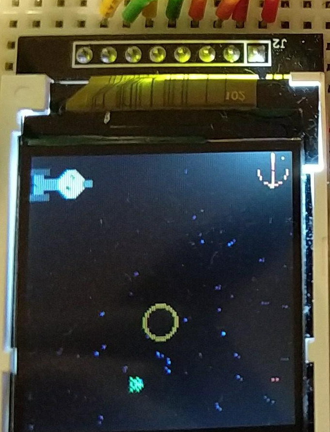

# FederationInvaders

Attempt at a Space Invaders clone with an Arduino, TFTLCD, Potentiometer

Uses https://github.com/chrisdepas/ST7735R for displaying to the ST7735R LCD, which is a fork of https://github.com/juj/ST7735R with name changes and SD Card related functionality removed

Expects
 - Potentiometer connected to A3
 - Speaker connected to D4
 - ST7735R LCD connected as specified in library above

